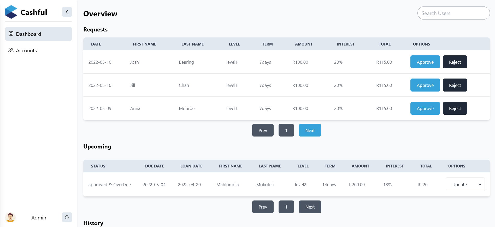
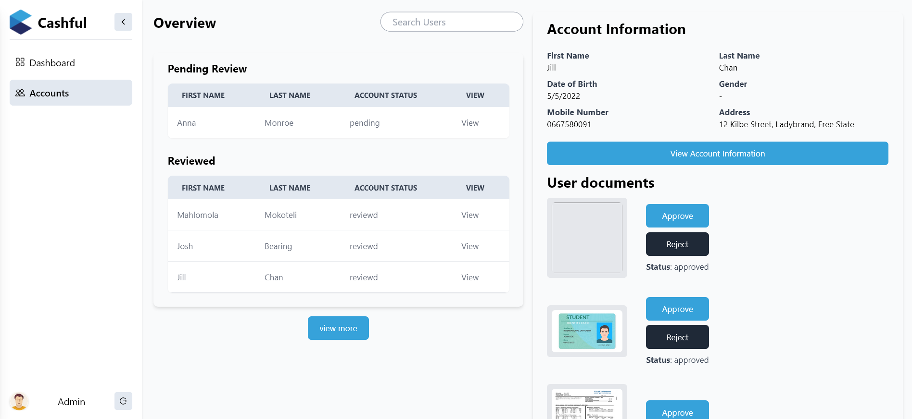

## Cashful admin panel with react js & firebase.

1. admin can login and view loan request, accept or reject them. 
1. admin can search loan request by user firstname.
1. admin can view account information and account document (approve,reject them)
1. search user also here.
1. edit bank and mtn information.
1. edit background information.

## how to deploy
1. added homepage in package.json file ["homepage": "https://cashful-admin.netlify.app"]
1. drag and drop _redirects file into dist folder
1. drag and drop the dist folder in netlify sites

## screenshots
> dashboard

> accounts
